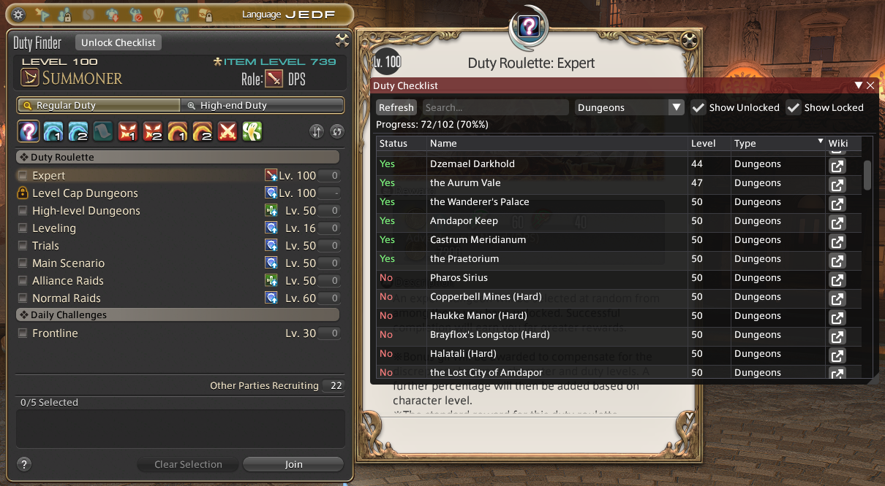

## DutyChecklist
A checklist plugin that shows all duties in the game and tracks which ones you have unlocked.



**Author:** Le Vagabond

## Installation
- Open the Dalamud Plugin Installer
- Go to Settings
- Head to the "Experimental" tab
- Under "Custom Plugin Repositories", paste this URL and click the `+` button:

  ```
  https://raw.githubusercontent.com/Le-Vagabond-gh/FFXIV_Dalamud_Repo/main/repo.json
  ```

- Press "Save and Close"
- Install "DutyChecklist" from the main plugin installer window

Updates then arrive through the plugin installer like for any other plugin.

If you would rather control updates yourself, download `dutychecklist-<version>-full.zip` from [Releases](https://github.com/Le-Vagabond-gh/ffxiv_dutychecklist/releases) (releases are immutable, so a published build can never be swapped), extract it and add the extracted `dutychecklist.dll` as a dev plugin location under the same "Experimental" tab.

## Usage
- Use `/dutychecklist` or `/dcl` to open the checklist window
- A "Duty Checklist" button also appears below the Duty Finder window when it's open

## Features
- View all duties in the game (dungeons, trials, raids, etc.)
- See which duties you have unlocked vs locked
- Filter by content type (Dungeons, Trials, Raids, Alliance Raids, etc.)
- Search duties by name
- Sort by clicking column headers
- Click the wiki icon to search for a duty on the FFXIV Wiki
- Progress counter showing how many duties you've unlocked
- Party Finder integration: shows the actual duty name when viewing a "Locked Duty" listing

## Disclaimer
This plugin shows the names of ALL duties in the game, including ones you haven't unlocked yet. If reading "The Final Trial of the Ultimate Extreme Savage Warrior of Light's Mom" before you get there ruins your immersion, that's on you. You have been warned. No refunds.
